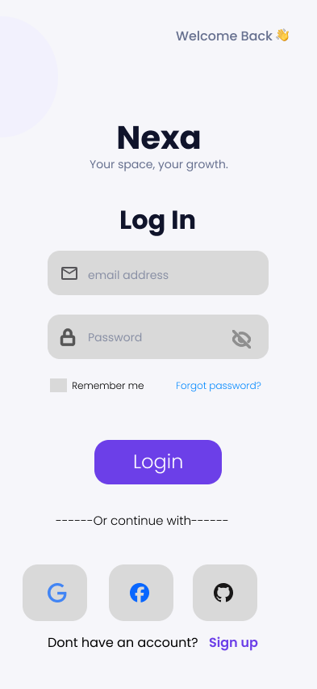
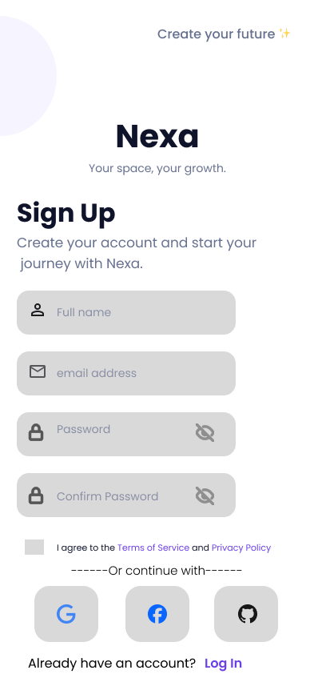
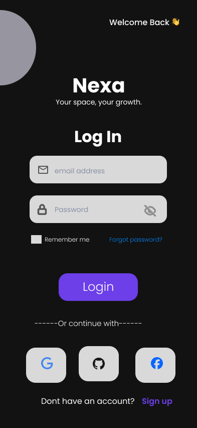
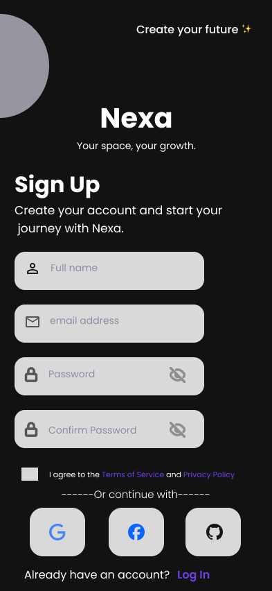

# UI/UX Design - Task 1

## Mobile App Login & Signup Screen

A mobile UI/UX design created using Figma as part of the Intern Alpha internship.

## Screens

- Login - Light Mode
- Sign Up - Light Mode
- Login - Dark Mode
- Sign Up - Dark Mode

## Prototype

The Login and Sign Up screens are connected through a clickable Figma prototype.
[View Figma Prototype]-[https://www.figma.com/proto/nZWJgQwz9g34dHMC7JkD7k/Intern-Alpha---UI-UX-Task-1?node-id=0-1&t=QCo6RZz7OmQLOrKC-1]

## Tool Used

- Figma
  
## Design Preview

### Login - Light Mode

### Sign Up - Light Mode

### Login - Dark Mode

### Sign Up - Dark Mode

